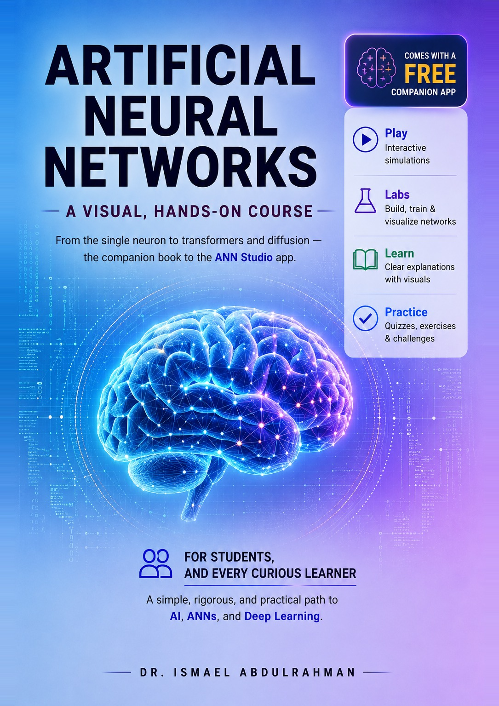

<div align="center">



# Artificial Neural Networks
### A visual, hands-on course — with a free companion app

**Read the idea → see it drawn → run it yourself.**

[**📱 Get the Android app**](#the-companion-app-android) &nbsp;·&nbsp; [**⬇ Download the book (PDF)**](https://ismaelabdulrahman.github.io/ann-studio/ANN-Studio-Textbook.pdf) &nbsp;·&nbsp; [**Python code**](python-code/)

[](LICENSE)
[](LICENSE-CONTENT.md)

</div>

---

**Artificial Neural Networks** is a complete, self-contained course that teaches neural networks the way they are best learned: you read a plain-English explanation, see it drawn as a diagram, then run the real code yourself. It comes with **ANN Studio**, a free companion app that runs live Python — both NumPy and PyTorch — right in your browser or on your phone, with no install and no setup.

The whole thing is **completely free**. If you find it useful and want to help it keep growing, voluntary support is warmly welcomed but never required.

## Start here

- **Just want to learn?** [Download the textbook (PDF)](https://ismaelabdulrahman.github.io/ann-studio/ANN-Studio-Textbook.pdf), and get the [ANN Studio Android app](#the-companion-app-android) to run everything hands-on.
- **Want to run the code?** Every example lives in [`python-code/`](python-code/), organized by chapter, or run it live inside the app.

## What's inside

```
docs/           The website — the live ANN Studio app, the landing page,
                and the textbook (PDF).
python-code/    Every Python example from the book, by chapter —
                223 NumPy + 50 PyTorch = 273 runnable files.
```

## Who it's for

Students, researchers, self-learners, and instructors — anyone who wants to learn AI, artificial neural networks, and deep learning in a way that is simple, accessible, and academically rigorous. No prior deep-learning background is assumed; the appendices cover the linear algebra, calculus, probability, and Python you need.

## The companion app (Android)

ANN Studio turns the book from something you read into something you *do* — it runs live Python (NumPy and PyTorch) right on your Android device.

The app is currently in **closed testing** on Google Play (it's free). To get it:

1. Use an **Android** phone or tablet.
2. Email the author at **ismael.abdulrahman@epu.edu.iq** and ask to join the ANN Studio test — send the **Google (Gmail) account you use on your Android device**, since that's the address that gets access.
3. Once you've been added to the testers, install it from Google Play: **[ANN Studio on Google Play](https://play.google.com/store/apps/details?id=com.annstudio.neuralnetworks)**.

Because it's a closed test, only approved testers can install it — that's why the email step is needed.

## License

- **Code** — the Python examples — is under the [MIT License](LICENSE).
- **Content** — the textbook text, figures, and diagrams — is under [Creative Commons Attribution 4.0 (CC BY 4.0)](LICENSE-CONTENT.md).

## How to cite

If you use this book, app, or code in your work, please cite it. GitHub's **"Cite this repository"** button (top right) reads [`CITATION.cff`](CITATION.cff) and gives you a ready-made citation.

## Support

The book and the app are and will remain free. If they have helped you and you would like to support their continued development, any voluntary contribution is deeply appreciated — but it is entirely optional, and everything here is fully usable without it.

## Author

**Dr. Ismael Khorshed Abdulrahman**
PhD in Electrical and Computer Engineering, Tennessee Technological University, USA
✉️ ismael.abdulrahman@epu.edu.iq

---

<div align="center">
<sub>Free and accessible. Code under MIT · Content under CC BY 4.0 · © 2026 Ismael Khorshed Abdulrahman</sub>
</div>
